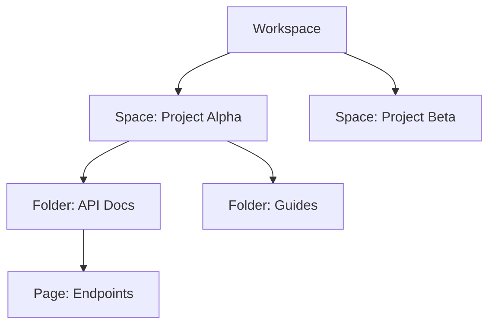

## Overview

Ben Smith provides a flexible documentation platform where you create and manage spaces for your projects. You organize content hierarchically, control access precisely, integrate with tools like GitHub and Slack, and customize branding to match your identity. These concepts form the foundation of effective documentation workflows.

<Columns cols={3}>
  <Card title="Spaces" icon="folder" href="#spaces">
    Organize docs into isolated spaces.
  </Card>
  <Card title="Permissions" icon="shield" href="#permissions">
    Granular role-based access.
  </Card>
  <Card title="Integrations" icon="plug" href="#integrations">
    Connect with external services.
  </Card>
</Columns>

## Documentation Spaces and Structure

Spaces act as containers for your documentation. You create a space for each project or team, containing pages, folders, and sub-spaces. This structure mirrors your organization's hierarchy.



Use folders to group related pages and leverage page-level metadata for SEO and navigation.

<Callout kind="tip">
  Start with a root space per major initiative to keep content focused.
</Callout>

## Permissions and Access Controls

You define permissions at the space, folder, or page level using roles like Viewer, Editor, and Admin. Assign users or groups to control who views, edits, or publishes content.

<Tabs>
  <Tab title="Role Definitions" icon="users">
    
| Role   | View | Edit | Publish | Admin |
|--------|------|------|---------|-------|
| Viewer | ✅   | ❌   | ❌      | ❌    |
| Editor | ✅   | ✅   | ❌      | ❌    |
| Admin  | ✅   | ✅   | ✅      | ✅    |

  </Tab>
  <Tab title="API Permissions" icon="key">
    Manage via API with role assignments.
    
````json
{
  "spaceId": "space_123",
  "userId": "user_456",
  "role": "editor"
}
````
  </Tab>
</Tabs>

## Integration with External Tools

Connect Ben Smith to GitHub for version control, Slack for notifications, or Zapier for automations. You configure webhooks to sync changes automatically.

<Steps>
  <Step title="Set Up Webhook" icon="plug">
    
1. Navigate to space settings.
2. Select `Integrations`.
3. Add webhook URL: `https://your-webhook-url.com/webhook`.

````bash
curl -X POST https://api.example.com/v1/webhooks \
  -H "Authorization: Bearer YOUR_TOKEN" \
  -d '{"url": "https://your-webhook-url.com/webhook"}'
````

  </Step>
  <Step title="Test Connection" icon="zap">
    Trigger a page update to verify events fire.
  </Step>
</Steps>

<CodeGroup tabs="GitHub,Slack">
```yaml
# GitHub Sync Config
repo: owner/repo
branch: main
path: docs/
```
```yaml
# Slack Notification
channel: #docs
events: [page.updated, space.published]
```
</CodeGroup>

## Customization and Branding Options

Tailor Ben Smith to your brand with custom domains, logos, and themes. Set a primary color like `#3B82F6` in space settings.

<Expandable title="Advanced Branding" default-open="false">
  
Configure via environment variables or API:

```javascript
const config = {
  primaryColor: '#3B82F6',
  logoUrl: 'https://your-logo.com/logo.png',
  customDomain: 'docs.yourcompany.com'
};
```

Upload assets directly in the dashboard at `https://dashboard.example.com/spaces/{spaceId}/branding`.
</Expandable>

<Callout kind="info">
  Test customizations in preview mode before publishing.
</Callout>

These concepts enable you to build scalable, secure documentation tailored to your needs. Explore [Quickstart](/quickstart) for hands-on setup.