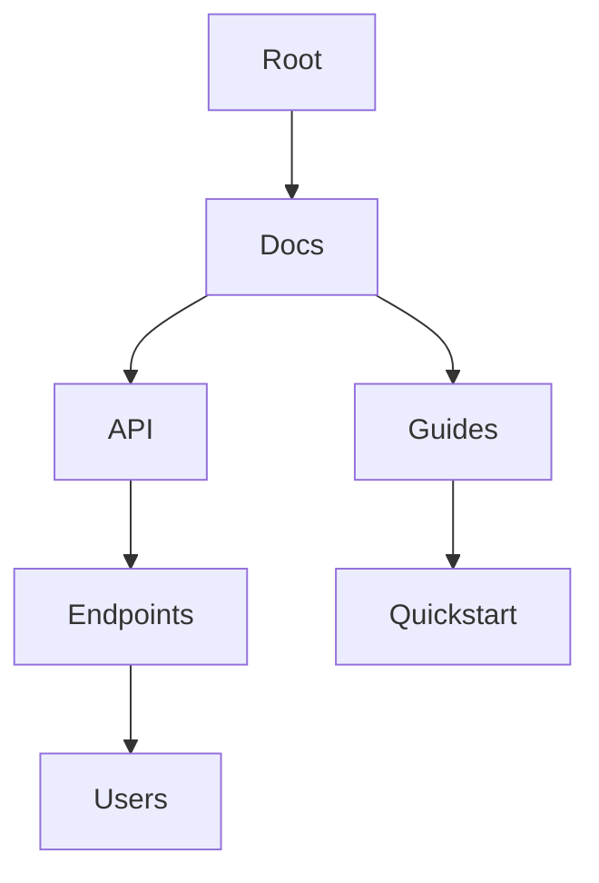

## Overview

Ben Smith provides powerful tools to manage your documentation efficiently. You organize content into hierarchies, collaborate with teams, track changes through version history, and find information quickly with advanced search features. These core capabilities help you maintain a centralized, accessible knowledge base.

<Columns cols={2}>
  <Card title="Organize Documents" icon="folder" href="#document-organization">
    Structure your docs with folders and pages.
  </Card>
  <Card title="Collaborate Seamlessly" icon="users" href="#collaboration">
    Share and review with your team.
  </Card>
  <Card title="Track Versions" icon="git-branch" href="#version-history">
    Never lose changes with full revision history.
  </Card>
  <Card title="Search Effectively" icon="search" href="#search-tools">
    Find content instantly with filters.
  </Card>
</Columns>

## Document Organization and Hierarchies

Create intuitive structures for your documentation using nested folders and pages. You build hierarchies that reflect your project's architecture, making navigation straightforward.

<Steps>
  <Step title="Create a Folder" icon="folder-plus">
    In the dashboard, select `New Folder` and name it, such as `API Reference`.
  </Step>
  <Step title="Add Pages" icon="file-plus">
    Inside the folder, create child pages. Use the drag-and-drop interface to reorder.
  </Step>
  <Step title="Set Permissions" icon="lock">
    Assign read/write access at the folder level.
  </Step>
</Steps>



<Callout kind="tip">
  Use hierarchies to mirror your codebase structure for easier maintenance.
</Callout>

## Collaboration and Sharing Options

Invite team members and share docs externally. You control access levels from view-only to full edit.

<Tabs>
  <Tab title="Team Invite" icon="users">
    Generate invite links with expiration dates.

    <CodeGroup tabs="CLI,API">
    ````bash
    ben-cli invite --email team@example.com --role editor --expires 30d
    ````
    ````javascript
    await fetch('https://api.example.com/v1/invites', {
      method: 'POST',
      headers: { 'Authorization': 'Bearer YOUR_TOKEN' },
      body: JSON.stringify({
        email: 'team@example.com',
        role: 'editor',
        expiresInDays: 30
      })
    });
    ````
    </CodeGroup>
  </Tab>
  <Tab title="Public Share" icon="globe">
    Create read-only links for clients.

    ```
    Share URL: https://docs.example.com/project/share/abc123
    ```
  </Tab>
</Tabs>

## Version History and Revisions

Every change is tracked automatically. You view, compare, and revert revisions at any time.

<Expandable title="View Revision History" default-open="true">
  Right-click a page and select `View History`. Compare diffs side-by-side.

  | Revision | Author | Date | Changes |
  |----------|--------|------|---------|
  | v1.2.0  | you@example.com | 2024-10-15 | Added auth section |
  | v1.1.0  | alice@example.com | 2024-10-10 | Fixed typos |
  | v1.0.0  | bob@example.com | 2024-10-01 | Initial draft |
</Expandable>

<Steps>
  <Step title="Revert Changes" icon="undo">
    Select a revision and click `Restore`.
  </Step>
  <Step title="Compare Versions" icon="git-compare">
    Highlight differences in added/removed lines.
  </Step>
</Steps>

## Search and Filtering Tools

Locate content across your entire space with full-text search and advanced filters.

<Callout kind="info">
  Search supports operators like `from:alice api` or `path:/guides/*`.
</Callout>

<Tabs>
  <Tab title="Basic Search" icon="search">
    Type keywords in the global search bar.
  </Tab>
  <Tab title="Advanced Filters" icon="filter">
    Filter by tags, authors, or date ranges.

    ````javascript
    // Example API search query
    const results = await fetch('https://api.example.com/v1/search', {
      method: 'POST',
      body: JSON.stringify({
        query: 'authentication',
        filters: {
          author: 'alice@example.com',
          after: '2024-10-01'
        }
      })
    });
    ````
  </Tab>
</Tabs>

## Next Steps

<Card title="Start Organizing" icon="folder" href="#document-organization">
  Set up your first hierarchy now.
</Card>

<Card title="Invite Your Team" icon="users" href="#collaboration">
  Bring collaborators onboard.
</Card>